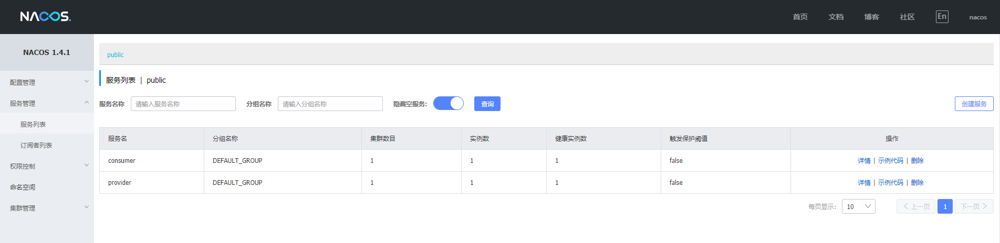
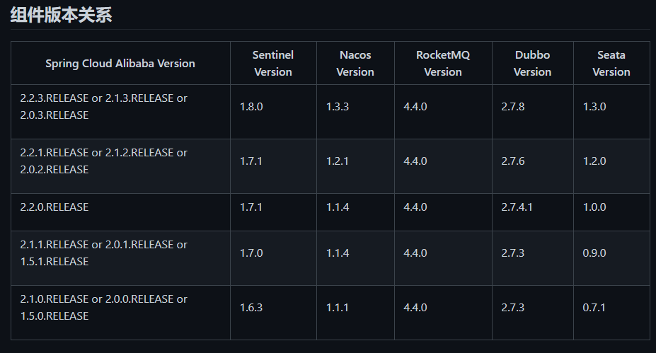
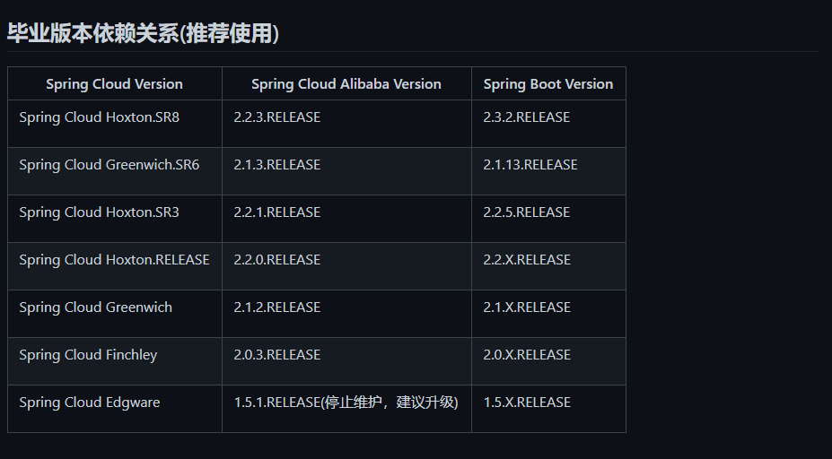
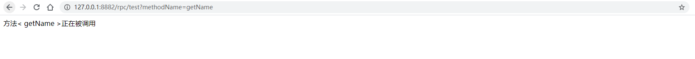

# DUBBO-DEMO

> 结合 spring-cloud 和 alibaba-cloud 的 dubbo rpc 调用

## 部署 nacos 服务

> 下载部署, 以单机模式启动即可

```sh
cd nacos/bin
sh startup.sh -m standalone
```



## 父依赖

### 版本

> [版本查看](https://github.com/alibaba/spring-cloud-alibaba/wiki/%E7%89%88%E6%9C%AC%E8%AF%B4%E6%98%8E)





### 父依赖

> ! 一定不要加这个依赖, 会冲突
>
> ```
> <dependency>
>     <groupId>org.springframework.boot</groupId>
>     <artifactId>spring-boot-devtools</artifactId>
>     <optional>true</optional>
> </dependency>
> ```

```xml
<?xml version="1.0" encoding="UTF-8"?>
<project xmlns="http://maven.apache.org/POM/4.0.0" xmlns:xsi="http://www.w3.org/2001/XMLSchema-instance"
         xsi:schemaLocation="http://maven.apache.org/POM/4.0.0 https://maven.apache.org/xsd/maven-4.0.0.xsd">
    <modelVersion>4.0.0</modelVersion>
    <packaging>pom</packaging>
    <parent>
        <groupId>org.springframework.boot</groupId>
        <artifactId>spring-boot-starter-parent</artifactId>
        <version>2.3.2.RELEASE</version>
        <relativePath/> <!-- lookup parent from repository -->
    </parent>
    <groupId>com.helltab.cloud</groupId>
    <artifactId>dubbo-demo</artifactId>
    <version>0.0.1-SNAPSHOT</version>
    <name>dubbo-demo</name>
    <description>Demo project for Spring Boot</description>
    <modules>
        <module>common</module>
        <module>api</module>
    </modules>
    <properties>
        <java.version>1.8</java.version>
    </properties>

    <dependencyManagement>
        <dependencies>
            <dependency>
                <groupId>com.alibaba.cloud</groupId>
                <artifactId>spring-cloud-alibaba-dependencies</artifactId>
                <version>2.2.3.RELEASE</version>
                <type>pom</type>
                <scope>import</scope>
            </dependency>
            <dependency>
                <groupId>org.springframework.cloud</groupId>
                <artifactId>spring-cloud-dependencies</artifactId>
                <version>Hoxton.SR8</version>
                <type>pom</type>
                <scope>import</scope>
            </dependency>
        </dependencies>
    </dependencyManagement>
    <dependencies>
        <dependency>
            <groupId>com.helltab.cloud</groupId>
            <artifactId>common</artifactId>
            <version>0.0.1-SNAPSHOT</version>
        </dependency>
        <dependency>
            <groupId>com.helltab.cloud</groupId>
            <artifactId>api</artifactId>
            <version>0.0.1-SNAPSHOT</version>
        </dependency>
        <dependency>
            <groupId>org.springframework.boot</groupId>
            <artifactId>spring-boot-starter-thymeleaf</artifactId>
        </dependency>
        <dependency>
            <groupId>org.springframework.boot</groupId>
            <artifactId>spring-boot-starter-web</artifactId>
        </dependency>

        <dependency>
            <groupId>org.springframework.boot</groupId>
            <artifactId>spring-boot-configuration-processor</artifactId>
            <optional>true</optional>
        </dependency>
        <dependency>
            <groupId>org.projectlombok</groupId>
            <artifactId>lombok</artifactId>
            <optional>true</optional>
        </dependency>
        <!-- Dubbo Spring Cloud Starter -->
        <dependency>
            <groupId>com.alibaba.cloud</groupId>
            <artifactId>spring-cloud-starter-dubbo</artifactId>
        </dependency>
        <!-- Spring Cloud Nacos Service Discovery -->
        <dependency>
            <groupId>com.alibaba.cloud</groupId>
            <artifactId>spring-cloud-starter-alibaba-nacos-discovery</artifactId>
        </dependency>
    </dependencies>

    <build>

    </build>

</project>

```

## 添加 common 模块

> 用于添加共有的配置

```yml
dubbo:
  protocol:
    name: dubbo
    port: -1
  registry:
    address: spring-cloud://192.168.2.10
spring:
  cloud:
    nacos:
      discovery:
        server-addr: 192.168.2.10:8848
```


## 添加 api 模块

> 用于规范 rpc 调用的方法和行为

## 添加 provider 模块

> 提供 rpc 服务

### 配置

```yml
spring:
  application:
    name: provider
  profiles:
    include: common
server:
  port: 8881
dubbo:
  scan:
    base-packages: com.helltab.cloud.provider.rpc
```

### 配置服务

> @DubboService

```java
@DubboService
public class DemoServiceImpl implements DemoService {
    @Override
    public String invoke(String name) {
        return "方法< " + name + " >正在被调用";
    }
}

```


## 添加 consumer 模块

> 接收 rpc 服务

### 配置

```yml
spring:
  application:
    name: consumer
  profiles:
    include: common
server:
  port: 8882
dubbo:
  cloud:
    subscribed-services: provider
```

### 使用

> @DubboReference(check = false)
>
> 添加 check = false 可以在启动时不检查服务提供者信息

```java
@RestController
@RequestMapping("rpc")
public class DemoController {
    @DubboReference(check = false)
    DemoService demoService;

    @RequestMapping("/test")
    public String test(String methodName) {
        return demoService.invoke(methodName);
    }
}
```



